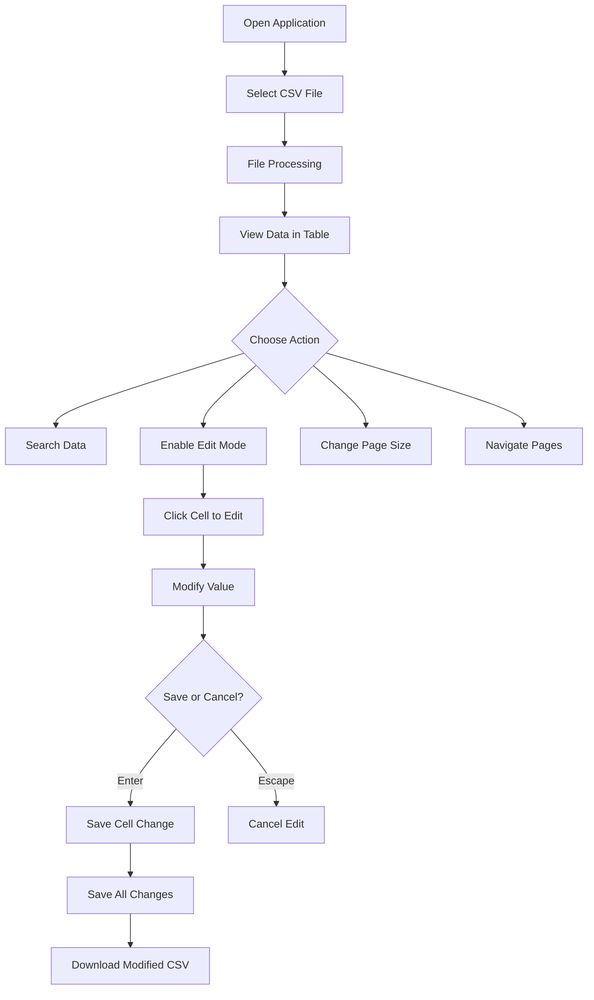
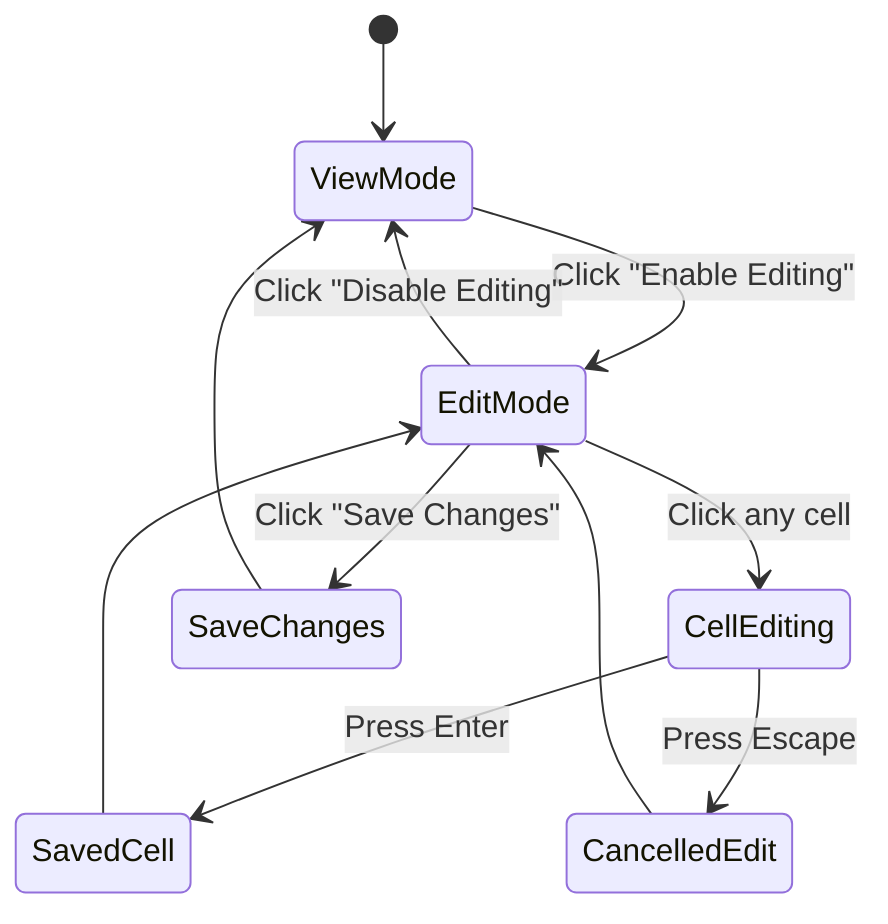
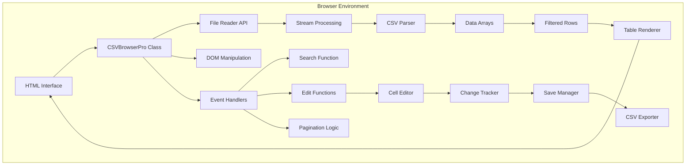

# xsukax CSV File Viewer & Editor

A powerful, privacy-focused web-based CSV file viewer and editor that operates entirely in your browser with zero server-side processing or data transmission.

## 📋 Table of Contents

- [Project Overview](#project-overview)
- [Security and Privacy Benefits](#security-and-privacy-benefits)
- [Features and Advantages](#features-and-advantages)
- [Installation Instructions](#installation-instructions)
- [Usage Guide](#usage-guide)
- [Architecture](#architecture)
- [Browser Compatibility](#browser-compatibility)
- [Contributing](#contributing)
- [License](#license)

## Project Overview

xsukax CSV File Viewer & Editor is a sophisticated single-page web application designed to provide comprehensive CSV file management capabilities directly in your web browser. Built with pure HTML5, CSS3, and vanilla JavaScript, this application eliminates the need for server-side processing, external dependencies, or desktop software installations.

The application addresses common challenges faced when working with CSV files, including handling large datasets, real-time editing capabilities, and maintaining data privacy. It offers enterprise-grade functionality while ensuring complete data sovereignty—your data never leaves your device.

## Security and Privacy Benefits

### 🔐 Complete Data Isolation

- **100% Client-Side Processing**: All CSV parsing, editing, and export operations execute locally in your browser's JavaScript engine
- **Zero Server Communication**: No API calls, telemetry, or data transmission to external servers
- **No Cloud Storage**: Files remain exclusively on your local device throughout the entire session
- **Session-Based Memory**: All data is cleared from browser memory when you close the tab

### 🛡️ Technical Security Measures

- **No External Dependencies**: Zero third-party JavaScript libraries, eliminating supply chain attack vectors
- **Content Security Policy Compatible**: Designed to work with strict CSP headers
- **No Cookies or Local Storage**: Prevents data persistence beyond the active session
- **Sanitized Input Handling**: Proper CSV parsing with quote escape handling to prevent injection attacks
- **Memory Management**: Active monitoring and efficient garbage collection for large datasets

### 🔍 Privacy Advantages

- **No User Tracking**: Absence of analytics, cookies, or fingerprinting mechanisms
- **No Account Required**: Full functionality without registration or authentication
- **Offline Capability**: Once loaded, works entirely offline without internet connectivity
- **Transparent Source Code**: Single-file architecture allows easy code auditing

## Features and Advantages

### Core Functionality

- **📊 Advanced Data Viewing**
  - Paginated table display with customizable page sizes (50-1000 rows)
  - Sticky headers for easy column reference while scrolling
  - Responsive design adapts to mobile and desktop screens

- **✏️ Comprehensive Editing**
  - Click-to-edit functionality with inline cell editing
  - Visual indicators for modified cells
  - Undo capability via Escape key during editing
  - Batch change tracking with save confirmation

- **🔍 Powerful Search**
  - Real-time search across all columns
  - Case-insensitive matching
  - Visual highlighting of search results
  - Result count display

- **💾 Data Management**
  - Stream-based file processing for large CSV files
  - Progress bar for file loading operations
  - Export functionality with timestamp-based filenames
  - Proper CSV formatting with quote escaping

### Performance Features

- **Memory Optimization**: Efficient data structure management
- **Chunk Processing**: Large files processed in segments to prevent UI blocking
- **Lazy Rendering**: Only visible rows rendered for optimal performance
- **Real-time Memory Monitoring**: Display of current memory usage

### User Experience

- **Modern Interface**: Clean, Apple-inspired design language
- **Intuitive Controls**: Clear visual hierarchy and action buttons
- **Responsive Feedback**: Toast notifications for user actions
- **Keyboard Shortcuts**: Enter to save, Escape to cancel edits

## Installation Instructions

### Option 1: Direct Browser Usage

1. Download the `index.html` file from this repository
2. Open the file in any modern web browser (Chrome, Firefox, Safari, Edge)
3. No installation or configuration required

### Option 2: Web Server Deployment

For organizational deployment on an internal web server:

```bash
# Clone the repository
git clone https://github.com/xsukax/xsukax-CSV-File-Viewer-Search-Editor.git

# Navigate to the directory
cd xsukax-CSV-File-Viewer-Search-Editor

# Serve using any static file server
# Example with Python:
python3 -m http.server 8000

# Or with Node.js:
npx http-server -p 8000
```

### Option 3: Local Development

```bash
# Clone and open directly
git clone https://github.com/xsukax/xsukax-CSV-File-Viewer-Search-Editor.git
cd xsukax-CSV-File-Viewer-Search-Editor

# Open in default browser (macOS/Linux)
open index.html

# Open in default browser (Windows)
start index.html
```

## Usage Guide

### Basic Workflow



### Step-by-Step Instructions

#### 1. Loading a CSV File

1. Click the "Choose CSV File" button
2. Select your CSV file from the file picker
3. Wait for the progress bar to complete
4. View file statistics (rows, columns, size)

#### 2. Navigating Data

- **Pagination Controls**: Use First/Previous/Next/Last buttons
- **Page Size**: Select from dropdown (50, 100, 250, 500, or 1000 rows)
- **Scroll**: Horizontal scrolling for wide tables

#### 3. Searching Data

1. Type search term in the search box
2. Results filter and highlight automatically
3. Search result count displays above the table
4. Clear search box to show all data

#### 4. Editing Data



1. **Enable Edit Mode**: Click "Enable Editing" button
2. **Edit Cell**: Click any cell to start editing
3. **Save Edit**: Press Enter or click outside the cell
4. **Cancel Edit**: Press Escape key
5. **Track Changes**: Modified cells show orange indicators
6. **Save All**: Click "Save Changes" to confirm all modifications
7. **Download**: Click "Download CSV" to export your edited data

### Advanced Features

#### Handling Large Files

The application uses streaming and chunked processing for optimal performance:

- Files up to 100MB process smoothly
- Progress bar indicates loading status
- Memory usage displayed in statistics

#### CSV Format Handling

- Automatic quote escaping for fields with commas
- Proper handling of multi-line cells
- Unicode support for international characters

## Architecture



### Core Components

- **CSVBrowserPro Class**: Main application controller
- **Stream Processor**: Handles large file reading in chunks
- **CSV Parser**: Custom implementation for reliable parsing
- **Table Renderer**: Efficient DOM updates with pagination
- **Edit Manager**: Tracks changes and handles save operations
- **Search Engine**: Real-time filtering with highlighting

## Browser Compatibility

| Browser | Minimum Version | Full Support |
|---------|----------------|--------------|
| Chrome | 90+ | ✅ |
| Firefox | 88+ | ✅ |
| Safari | 14+ | ✅ |
| Edge | 90+ | ✅ |
| Opera | 76+ | ✅ |

### Required Browser APIs

- File API for file reading
- Blob API for file downloads
- ES6+ JavaScript features

## Contributing

We welcome contributions to improve xsukax CSV File Viewer & Editor.

### Development Guidelines

- Maintain zero external dependencies
- Ensure all processing remains client-side
- Follow existing code style and documentation standards
- Include comments for complex logic
- Test with various CSV formats and sizes

## License

This project is licensed under the **GNU General Public License v3.0 (GPL-3.0)**.

### What this means for you:

- **Freedom to Use**: You can use this software for any purpose, personal or commercial
- **Freedom to Study**: You can examine and audit the source code
- **Freedom to Modify**: You can modify the software to suit your needs
- **Freedom to Share**: You can redistribute the original or modified versions

### Key Requirements:

- **Copyleft**: Any derivative work must also be licensed under GPL-3.0
- **Source Disclosure**: If you distribute this software, you must provide access to the source code
- **License Notices**: You must retain all copyright and license notices

For the full license text, see the [LICENSE](LICENSE) file in this repository or visit [GNU GPL v3.0](https://www.gnu.org/licenses/gpl-3.0.en.html).

---

**Note**: This application prioritizes your privacy and data security. No telemetry, tracking, or external communication occurs. Your CSV files remain completely under your control.
